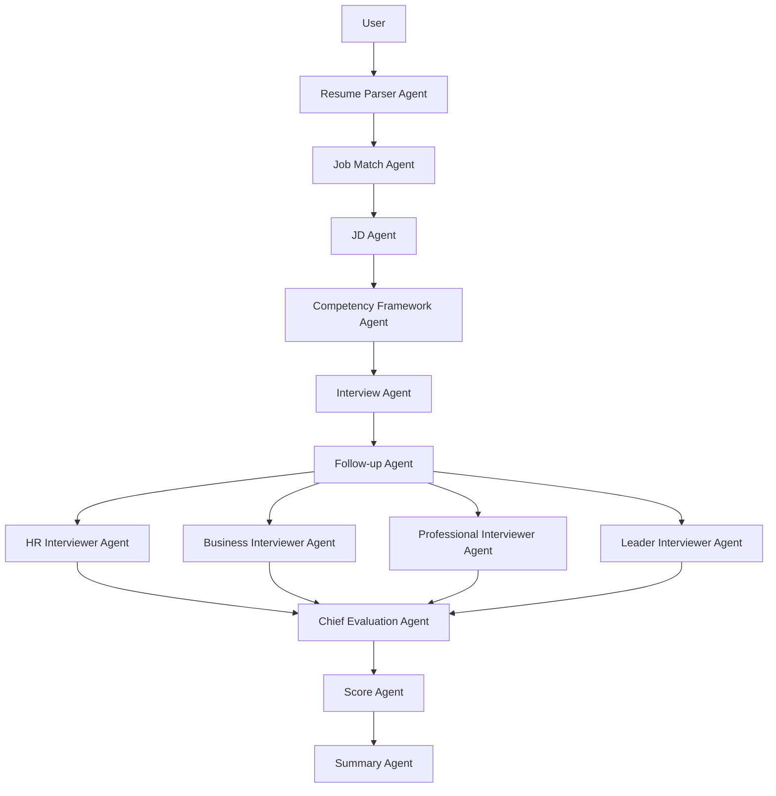
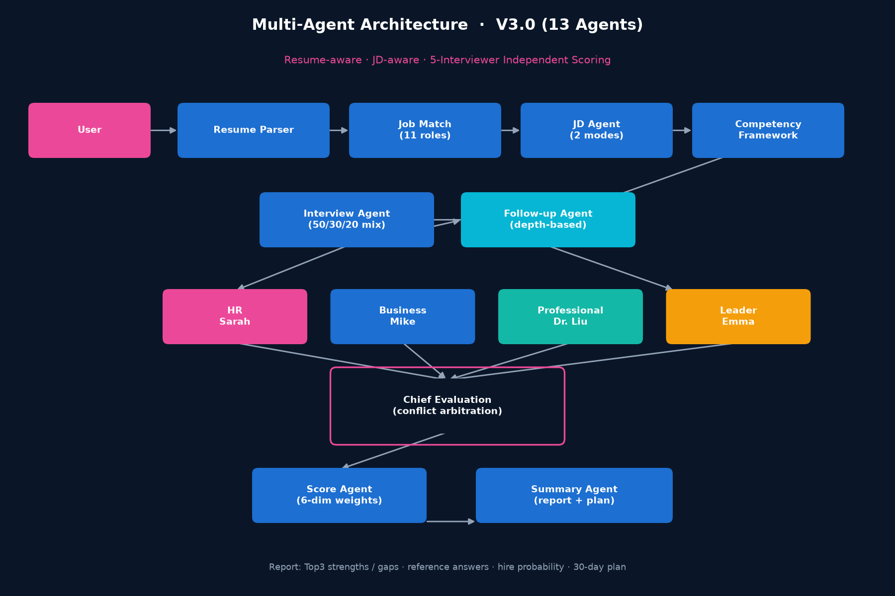
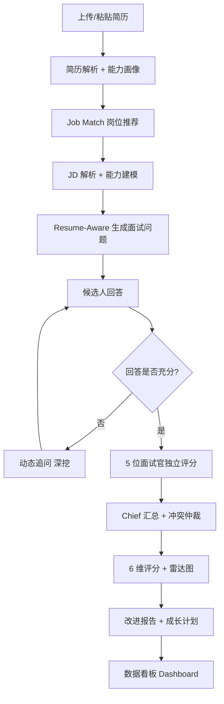
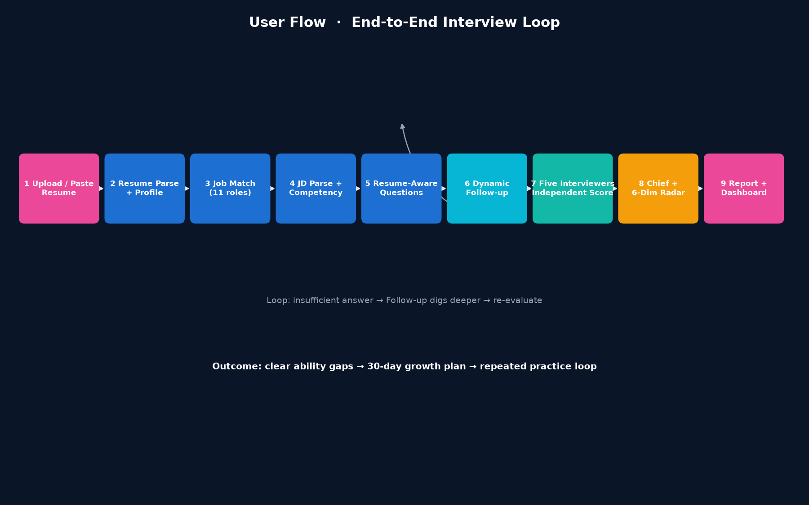

# AI Career Copilot · Resume-Aware Career Interview Agent

> 基于 **Multi-Agent 架构**的 AI 求职与面试陪练系统：上传简历 → 岗位匹配 → JD 解析 → 能力建模 → Resume-Aware 模拟面试 → **5 位虚拟面试官独立评分** → 多维报告与成长建议。
>
> 一个把"读懂简历的 AI 面试官"做成了**可秒开、免安装、免 API Key** 的高保真原型，并配套一个**真实调用大模型的 Python 后端**用于工程落地。

> **适合岗位**：AI 产品经理 / AI 应用开发（实习）

---

## 🚀 30 秒看懂

| 你想看什么 | 怎么看 |
|-----------|--------|
| **完整产品交互（推荐先打开）** | 直接用浏览器打开根目录 `index.html`，无需安装、无需 Key |
| **真实大模型工程实现** | 进入 `python-backend/`，配置 Key 后 `streamlit run app.py` |
| **产品与架构文档** | 见 `docs/PRD.md`、`docs/competency_framework.md` 与架构图 |

---

## 目录

- [1. 项目背景](#1-项目背景)
- [2. 产品目标](#2-产品目标)
- [3. 核心功能（已实现）](#3-核心功能已实现)
- [4. Multi-Agent 架构](#4-multi-agent-架构)
- [5. 评分体系](#5-评分体系)
- [6. 产品流程](#6-产品流程)
- [7. 技术栈](#7-技术栈)
- [8. 项目亮点](#8-项目亮点)
- [9. 项目角色](#9-项目角色)
- [10. 项目难点](#10-项目难点)
- [11. Future Roadmap（真实待开发方向）](#11-future-roadmap真实待开发方向)
- [12. 快速开始](#12-快速开始)
- [13. 目录结构](#13-目录结构)
- [14. 安全说明](#14-安全说明)

---

## 1. 项目背景

传统求职准备存在结构性低效：

- **岗位匹配靠肉眼**：候选人难以判断自己与目标岗位的契合度，准备方向发散。
- **面试准备缺乏针对性**：通用面试题库与本人经历脱节，"背题"难以迁移到真实追问。
- **面试评价单一**：自评或单次反馈缺乏结构化维度，不知道"差在哪、怎么补"。
- **缺乏持续成长反馈**：一次面试结束即终止，没有"评估 → 改进 → 再评估"的闭环。

大语言模型与 Agent 技术的成熟，使"低成本、个性化、可溯源"的 AI 陪练成为可能。

---

## 2. 产品目标

帮助用户完成闭环：

> **找到适合的岗位 → 针对简历与 JD 准备 → 进行真实模拟面试 → 获得多维评价 → 明确能力差距 → 拿到成长计划**

---

## 3. 核心功能（已实现）

以下能力均已在 `index.html`（V3.0）原型中落地：

| 功能 | 说明 | 状态 |
|------|------|------|
| 简历解析 | 粘贴文本即可解析，输出结构化能力画像 | ✅ 原型已实现 |
| 岗位推荐（Job Match Agent） | 基于画像推荐 **11 个**匹配职位，含匹配分 / 推荐原因 / 核心技能 / 能力缺口 / 发展路径 | ✅ 原型已实现 |
| JD 解析（JD Agent） | 双模式：自动生成 JD / 粘贴 Boss直聘·拉勾·猎聘·智联 等平台 JD 自动解析 | ✅ 原型已实现 |
| 能力建模（Competency Framework） | 按岗位类型生成能力树，支撑差异化评分权重 | ✅ 原型已实现 |
| **Resume-Aware 面试** | 问题 = 50% 简历 + 30% JD + 20% 能力模型，强制引用具体经历 | ✅ 原型已实现 |
| 动态追问（Follow-up Agent） | 依据回答深度逐层递进，识别浅层/模糊回答并引导展开 | ✅ 原型已实现 |
| **多面试官独立评分** | HR / Business / Professional / Leader / Chief **5 位虚拟面试官**各自独立打分 | ✅ 原型已实现 |
| 多维度评分 | **6 维度动态权重**评分（按岗位类型差异化） | ✅ 原型已实现 |
| 面试报告 | Top3 优势 / 短板 / 参考答案 / 录用概率预测 | ✅ 原型已实现 |
| 数据看板（Dashboard） | 多面试官分布、评分热力图、概率趋势等数据视图 | ✅ 原型已实现 |

> **关于"已实现"的诚实说明**：`index.html` 是一套**前端高保真原型**，其 Agent 协作、问题生成与评分逻辑采用**脚本化/规则模拟**实现，因此可做到免 Key 秒开、交互完整。它用于完整呈现产品设计与交互流程；**真正调用大模型的生产级实现**在 `python-backend/`（见第 7、12 节）。

---

## 4. Multi-Agent 架构

V3.0 原型内包含 **13 个协作 Agent**，覆盖从简历输入到录用决策的完整链路：





| Agent | 职责 |
|-------|------|
| **Resume Parser** | 简历解析与结构化，生成能力画像 |
| **Job Match** | 基于画像推荐匹配职位（11 个） |
| **JD Agent** | 生成 / 解析职位描述，抽取硬技能·软技能·业务要求 |
| **Competency Framework** | 按岗位类型生成能力树，确定评分维度 |
| **Interview** | 50% 简历 + 30% JD + 20% 能力模型 混合问题生成 |
| **Follow-up** | 动态追问，按深度递进 |
| **HR / Business / Professional / Leader Interviewer** | 四位角色分别从动机沟通 / 业务理解 / 专业深度 / 潜力Owner 角度独立评分 |
| **Chief Evaluation** | 汇总多面试官评分、仲裁冲突（>15 分差异自动分析）、最终决策 |
| **Score** | 6 维度动态权重评分 |
| **Summary** | 个性化报告 + 成长计划 |

> 工程落地版（`python-backend/`）当前实现了解析 / 面试 / 追问 / 评分 / 总结 核心闭环，并真实调用 SiliconFlow（Qwen）大模型；多面试官与岗位推荐/JD 解析的**生产级 LLM 实现**为 Roadmap 方向（见第 11 节）。

---

## 5. 评分体系

采用 **6 维度、动态权重、evidence-based** 评分。不同岗位类型使用不同维度权重（原型内可切换 AI PM / 数据 / 技术 / 运营 等类型）。

| 维度 | 评估重点 |
|------|----------|
| 沟通能力（comm） | 表达清晰度、逻辑连贯、观点传达 |
| 业务理解（biz） | 商业敏感度、业务拆解、ROI 意识 |
| 专业深度（tech） | 岗位硬技能、技术/方法论掌握 |
| 领导力（leader） | Owner 意识、决策、抗压与团队带动 |
| 策略思维（strategy） | 抽象建模、系统性、长期视角 |
| 文化匹配（culture） | 价值观、协作意识、岗位契合 |

**多面试官交叉评分**是缓解"单一 AI 评分偏差"的核心机制：HR / Business / Professional / Leader 各自独立打分，Chief Evaluation 汇总并标注分歧，避免出现单一视角偏见。

---

## 6. 产品流程





---

## 7. 技术栈

| 类别 | 技术 |
|------|------|
| **原型（旗舰）** | 纯 HTML / CSS / JavaScript 单文件应用，Chart.js 可视化，Web Speech API 语音输入 |
| **后端工程（`python-backend/`）** | Python 3.10+ · Streamlit · OpenAI 兼容 SDK · SiliconFlow（Qwen / Qwen2.5-72B-Instruct）· PyPDF2 / python-docx · python-dotenv |
| **工程方法** | Multi-Agent 模块化设计、Prompt Engineering、Git、产品文档驱动开发 |

> 未使用虚构技术；原型为独立静态页（无需后端），后端工程真实调用大模型。

---

## 8. 项目亮点

1. **Resume-Aware Interview**：问题强制引用简历具体经历，个性化而非通用题库。
2. **多面试官独立评分**：HR / Business / Professional / Leader 四角色交叉打分 + Chief 仲裁，规避单一视角偏差。
3. **JD-Aware + 岗位库结合**：问题同时融合简历、JD 与能力模型三方信号。
4. **动态权重评分**：评分维度权重随岗位类型变化，更贴近真实招聘标准。
5. **完整产品闭环**：简历 → 岗位推荐 → JD 解析 → 能力建模 → 模拟面试 → 报告 → 看板。
6. **秒开免 Key 原型 + 真实 LLM 后端**：兼顾" recruiters 秒懂"与"工程落地可信"。
7. **安全与隐私优先**：API Key 仅本地、简历仅以文本送入模型、绝不入库。

---

## 9. 项目角色

**AI 产品经理 / AI 应用开发**

本人负责：

- 产品定位与用户流程设计
- Multi-Agent 架构设计（13 Agent 编排）
- 评分体系与能力模型设计（见 [`docs/competency_framework.md`](docs/competency_framework.md)）
- Prompt 工程与交互设计
- 原型前端实现（`index.html`）与后端工程实现（`python-backend/`）
- PRD 与文档撰写（见 [`docs/PRD.md`](docs/PRD.md)）
- 项目部署与 GitHub 整理

---

## 10. 项目难点

- **让 AI 真正理解简历**：结构化 Schema 约束解析，降低自由文本歧义。
- **根据简历 + JD 生成针对性问题**：强制 `resume_ref` + `jd_ref` + `competency` 三方信号，从机制上保证相关性。
- **实现动态追问**：依据回答深度逐层递进，把敷衍回答转化为有效评估信号。
- **避免单一 AI 评分偏差**：多面试官交叉评分 + Chief 冲突仲裁 + evidence 约束。
- **设计岗位差异化评分**：维度与问题对齐，按岗位类型动态权重。

---

## 11. Future Roadmap（真实待开发方向）

当前 `index.html` 原型的 Agent 协作与评分是**脚本化/规则模拟**。下一步的真实演进方向（即"待开发"）聚焦于**让面试更真实、评分更可信**：

1. **评分更社会化、生活化**：把刻板的维度打分，升级为"像真人在面试"的自然评价语言与情境化反馈，让候选人感觉真的在被面试。
2. **评分更准确 / 可解释**：接入真实大模型驱动评分，强化 evidence 约束与多面试官一致性校验，降低模拟误差。
3. **模拟真人面试体验**：从"问答列表"演进为带语气、追问节奏、情绪感知的拟人化面试流程。
4. **真实 LLM 后端补全**：将原型中的岗位推荐 / JD 解析 / 多面试官评分 用 `python-backend/` 的真实大模型调用完整落地。
5. **RAG 岗位知识库 / 企业真实面试题库**：提升问题专业度与实战贴近度。
6. **用户长期成长数据**：跨多次模拟的能力轨迹与对比。
7. **面试语音分析**：结合 Web Speech API 做表达流畅度、语速、停顿分析。
8. **更完善的 Dashboard**：能力趋势、岗位匹配分布等数据看板深化。

---

## 12. 快速开始

### 12.1 体验完整原型（推荐，无需安装）

直接用浏览器打开仓库根目录的 `index.html` 即可，无需 API Key、无需后端。

### 12.2 运行真实大模型后端

```bash
cd python-backend
pip install -r requirements.txt
cp .env.example .env          # 填入 SILICONFLOW_API_KEY
streamlit run app.py
```

获取 SiliconFlow Key：https://cloud.siliconflow.cn/

---

## 13. 目录结构

```
resume-aware-interview-agent/
├── index.html                 # 🌟 旗舰原型（V3.0，免 Key 秒开，13 Agent + 5 面试官）
├── chart.umd.min.js          # 原型依赖（本地 Chart.js，离线可用）
├── README.md
├── .gitignore
│
├── python-backend/           # 真实大模型后端工程（Streamlit + SiliconFlow/Qwen）
│   ├── app.py, config.py
│   ├── agents/               # Resume Parser / Interview(+Follow-up) / Score / Summary
│   ├── utils/                # llm_client(SiliconFlow) / file_parser(PDF·DOCX)
│   ├── prompts/              # Prompt 工程文档
│   ├── requirements.txt, .env.example
│   └── README.md
│
├── docs/                     # 产品与架构文档
│   ├── PRD.md
│   ├── competency_framework.md
│   ├── agent_architecture.png
│   ├── user_flow.png
│   └── system_architecture.png
│
├── screenshots/              # 应用界面截图（运行后请补充）
├── uploads/                  # 运行时上传目录（不入库）
└── logs/                     # 运行时日志目录（不入库）
```

---

## 14. 安全说明

- **绝不**将真实 API Key、`.env`、个人简历原文上传至仓库（已被 `.gitignore` 忽略）。
- 上传的简历仅在会话内以文本形式送入大模型，不做云端持久化。
- 演示如需简历样例，请使用**虚拟简历**，禁止包含真实姓名 / 手机号 / 邮箱密码 / 身份证等信息。
- 本项目仅用于求职陪练与学习，请遵守所选大模型平台的使用条款。

---

<p align="center">
  <sub>AI Career Copilot · Resume-Aware Career Interview Agent</sub>
</p>
