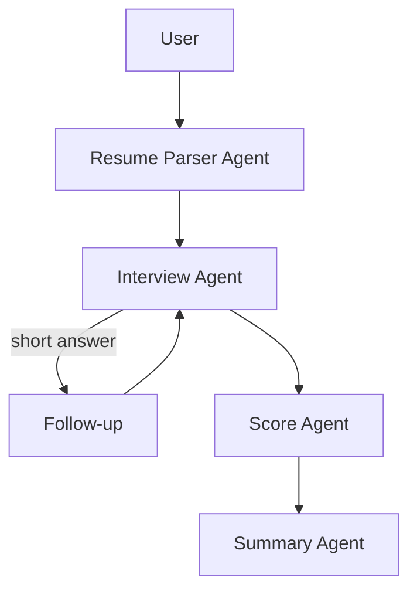
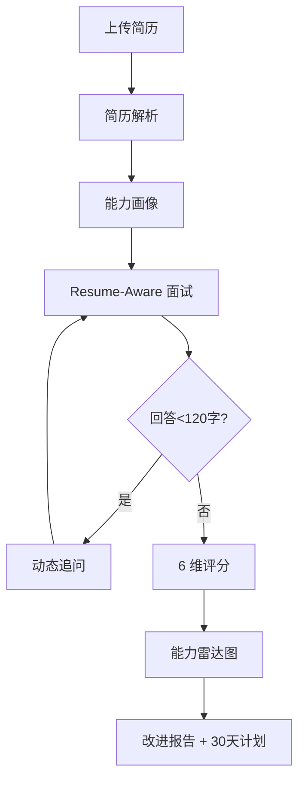
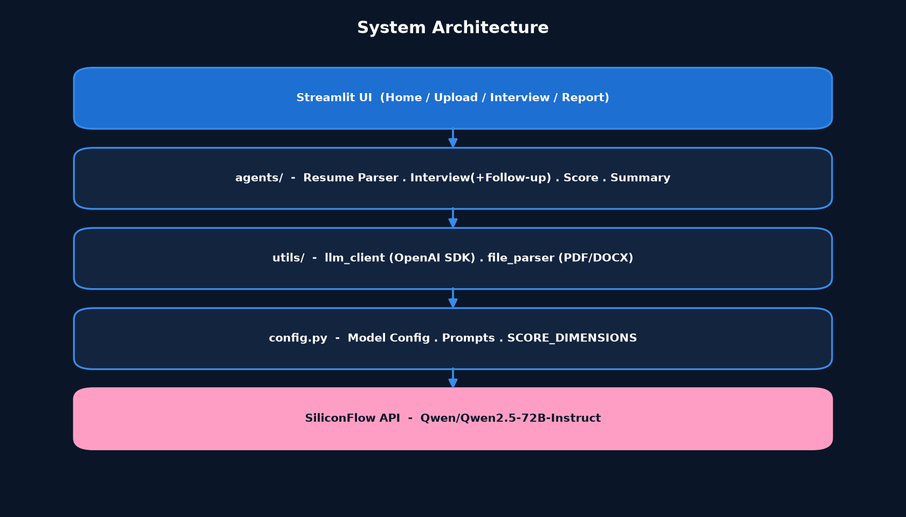

# Resume-Aware Career Interview Agent

> 基于 LLM 与 Multi-Agent 架构的 AI 求职与面试陪练系统，实现从简历解析、能力画像、Resume-Aware 模拟面试到多维度评分与成长建议的完整求职闭环。

> **AI Career Copilot · 简历感知 AI 求职与面试助手**
> 适合岗位：AI 产品经理 / AI 应用开发（实习）

---

## 目录

- [1. 项目背景](#1-项目背景)
- [2. 产品目标](#2-产品目标)
- [3. 核心功能](#3-核心功能)
- [4. Multi-Agent 架构](#4-multi-agent-架构)
- [5. 评分体系](#5-评分体系)
- [6. 产品流程](#6-产品流程)
- [7. 技术栈](#7-技术栈)
- [8. 项目亮点](#8-项目亮点)
- [9. 项目角色](#9-项目角色)
- [10. 项目难点](#10-项目难点)
- [11. Future Roadmap](#11-future-roadmap)
- [12. 快速开始](#12-快速开始)
- [13. 目录结构](#13-目录结构)
- [14. 安全说明](#14-安全说明)

---

## 1. 项目背景

传统求职准备存在低效：

- **岗位匹配困难**：候选人难以判断自己与岗位的契合度，准备方向发散。
- **面试准备缺乏针对性**：通用面试题库与本人经历脱节，"背题"难以迁移到真实追问。
- **面试评价单一**：自评或单次反馈缺乏结构化维度，不知道"差在哪、怎么补"。
- **缺乏持续成长反馈**：一次面试结束即终止，没有"评估 → 改进 → 再评估"的闭环。

大语言模型与 Agent 技术的成熟，使"低成本、个性化、可溯源"的 AI 陪练成为可能。

---

## 2. 产品目标

帮助用户完成闭环：

> **找到适合的岗位 → 针对简历准备 → 进行真实模拟面试 → 获得多维评价 → 明确能力差距 → 拿到 30 天成长计划**

---

## 3. 核心功能

| 功能 | 说明 | 状态 |
|------|------|------|
| 简历解析 | 支持 PDF / DOCX，输出结构化 JSON（教育 / 经历 / 项目 / 技能四分类） | ✅ 已实现 |
| 能力画像 | 基于简历生成摘要与技能分组（技术 / 数据 / 产品 / AI·ML） | ✅ 已实现 |
| **Resume-Aware 面试** | 每个问题都引用简历具体项目/经历，杜绝通用背题 | ✅ 已实现 |
| 动态追问 | 回答 < 120 字自动深挖，引导给出具体细节 | ✅ 已实现 |
| 多维度评分 | 6 维度评分 + 证据（evidence），Plotly 雷达图 | ✅ 已实现 |
| 面试报告 | 优势 / 短板 / 改进建议 / 30 天行动计划 | ✅ 已实现 |
| 岗位推荐 / JD 解析 | 结合岗位库与 JD 生成问题 | 🔜 规划中 |
| 多面试官角色评分 | HR / Business / Professional / Leader 独立评分 | 🔜 规划中 |

---

## 4. Multi-Agent 架构

当前 MVP 采用 **4-Agent 协作**（由 `agents/` 模块承载），所有 Agent 共享同一个 LLM 调用（通过 `utils/llm_client` 连接 SiliconFlow / Qwen）。




| Agent | 职责 |
|-------|------|
| **Resume Parser** | 简历解析与结构化，生成能力画像 |
| **Interview** | Resume-Aware 问题生成；回答过简时触发 Follow-up 追问 |
| **Score** | 6 维度评分，每维度附证据（evidence） |
| **Summary** | 生成优势 / 短板 / 建议 / 30 天计划报告 |

> 规划演进：在 4-Agent 之上扩展 Job Match、JD、多面试官角色与 Chief Evaluation Agent，形成更完整的面试委员会。详见 [`docs/PRD.md`](docs/PRD.md)。

---

## 5. 评分体系

采用 **6 维度、1–10 分、evidence-based** 评分，每个分数都必须附带评分依据，将主观印象转为可追溯证据——这是缓解"单一 AI 评分偏差"的核心机制。

| 维度 | 评估重点 |
|------|----------|
| 沟通能力 | 表达清晰度、逻辑连贯、观点传达 |
| 技术深度 | 技术栈理解、岗位硬技能 |
| 项目经验 | 项目细节、个人贡献与成果 |
| 问题解决 | 追问应变、思路清晰度 |
| 文化匹配 | 价值观与岗位匹配、协作意识 |
| 成长潜力 | 学习能力、自驱力、职业规划 |

> 规划：演进为多面试官角色独立评分 + Chief 汇总 + 按岗位类型动态权重。详见 [`docs/competency_framework.md`](docs/competency_framework.md)。

---

## 6. 产品流程






---

## 7. 技术栈

| 类别 | 技术 |
|------|------|
| 语言 | Python 3.10+ |
| Web 框架 | Streamlit（多页面应用） |
| LLM 调用 | OpenAI 兼容 SDK（`openai`），连接 SiliconFlow API |
| 大模型 | Qwen / Qwen2.5-72B-Instruct（可替换为任意 OpenAI 兼容模型） |
| 可视化 | Plotly（评分雷达图） |
| 文档解析 | PyPDF2（PDF）、python-docx（Word） |
| 配置管理 | python-dotenv（`.env`） |
| 工程 | Git、Multi-Agent 模块化设计、Prompt Engineering |

> 未使用虚构技术；前端免 Key 体验版（`web-demo/`）为独立静态页面，无需后端。

---

## 8. 项目亮点

1. **Resume-Aware Interview**：问题强制引用简历具体经历，个性化而非通用题库。
2. **Evidence-based 评分**：每维分数附带依据，可追溯、可解释。
3. **动态追问**：轻量字数阈值触发，把敷衍回答转化为有效评估信号。
4. **Multi-Agent 协同**：解析 / 面试 / 评分 / 总结职责解耦，易扩展。
5. **能力闭环**：从简历到 30 天成长计划，形成"评估—改进"循环。
6. **安全与隐私优先**：API Key 仅本地、简历仅以文本送入模型、绝不入库。

---

## 9. 项目角色

**AI 产品经理 / AI 应用开发**

本人负责：

- 产品定位与用户流程设计
- Multi-Agent 架构设计
- Prompt 工程（见 [`prompts/`](prompts/)）
- 评分体系与能力模型设计（见 [`docs/competency_framework.md`](docs/competency_framework.md)）
- Streamlit 前端交互实现
- PRD 与文档撰写（见 [`docs/PRD.md`](docs/PRD.md)）
- 项目部署与 GitHub 整理

---

## 10. 项目难点

- **让 AI 真正理解简历**：用结构化 JSON Schema 约束解析，降低自由文本歧义。
- **根据简历生成针对性问题**：强制 `resume_ref` 字段引用经历，从机制上保证相关性。
- **实现动态追问**：字数阈值 + 定点深挖 Prompt，低成本提升评估信噪比。
- **避免单一 AI 评分偏差**：evidence 约束 + 规划多面试官交叉评分。
- **设计岗位差异化评分**：维度与问题对齐，规划按岗位类型动态权重。

---

## 11. Future Roadmap

- RAG 岗位知识库
- 企业真实面试题库
- 更多岗位能力模型与动态权重
- 用户长期成长数据轨迹
- 面试语音分析（Web Speech API）
- 多模态面试与更完善 Dashboard

---

## 12. 快速开始

### 12.1 安装依赖

```bash
pip install -r requirements.txt
```

### 12.2 配置 API Key

复制环境变量模板并填入你的 Key（**切勿提交真实 Key**）：

```bash
cp .env.example .env
# 编辑 .env：
# SILICONFLOW_API_KEY=your_api_key_here
# MODEL_NAME=Qwen/Qwen2.5-72B-Instruct
```

获取 SiliconFlow Key：https://cloud.siliconflow.cn/

### 12.3 运行

```bash
streamlit run app.py
```

浏览器打开提示的本地地址即可使用。

### 12.4 免 Key 体验版（Web Demo）

`web-demo/` 提供一个**纯前端、无需 API Key** 的体验版（`index.html`），可直接用浏览器打开，适合快速查看完整交互流程（该版本为前端模拟，不调用真实大模型）。

---

## 13. 目录结构

```
resume-aware-interview-agent/
├── app.py                     # Streamlit 主应用（页面路由与流程编排）
├── config.py                  # 模型配置 / 评分维度 / Prompt 模板
├── requirements.txt           # 真实依赖（与代码 import 一致）
├── .env.example               # API Key 模板（不提交真实 Key）
├── .gitignore
├── README.md
│
├── agents/                    # Multi-Agent 实现
│   ├── resume_parser.py       # Resume Parser Agent
│   ├── interview.py           # Interview Agent（+ Follow-up）
│   ├── score.py               # Score Agent（6 维 + 雷达图数据）
│   └── summary.py             # Summary Agent
│
├── utils/                     # 工具层
│   ├── llm_client.py          # OpenAI 兼容客户端（SiliconFlow）
│   └── file_parser.py         # PDF / DOCX 解析与校验
│
├── prompts/                   # Prompt 工程文档（设计说明）
│   ├── resume_prompt.md
│   ├── interview_prompt.md
│   ├── followup_prompt.md
│   ├── scoring_prompt.md
│   └── summary_prompt.md
│
├── docs/                      # 产品与架构文档
│   ├── PRD.md
│   ├── competency_framework.md
│   ├── agent_architecture.png
│   ├── user_flow.png
│   └── system_architecture.png
│
├── screenshots/               # 应用界面截图（运行后请补充，见 README 第 9 节说明）
│
├── web-demo/                  # 免 Key 前端体验版（独立静态页）
│
├── uploads/                   # 运行时上传目录（不入库）
└── logs/                      # 运行时日志目录（不入库）
```

---

## 14. 安全说明

- **绝不**将真实 API Key、`.env`、个人简历原文上传至仓库（已被 `.gitignore` 忽略）。
- 上传的简历仅在会话内以文本形式送入大模型，不做云端持久化。
- 演示如需简历样例，请使用**虚拟简历**，禁止包含真实姓名 / 手机号 / 邮箱密码 / 身份证等信息。
- 本项目仅用于求职陪练与学习，请遵守所选大模型平台的使用条款。

---

<p align="center">
  <sub>Resume-Aware Career Interview Agent · AI Career Copilot</sub>
</p>
