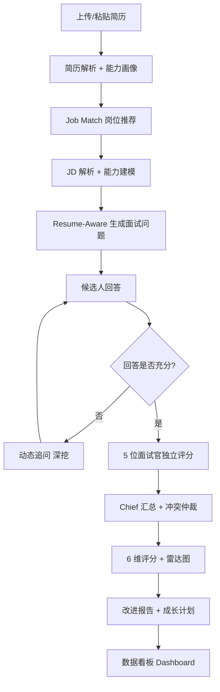

# PRD｜AI Career Copilot · Resume-Aware Career Interview Agent

> 文档版本：v2.0（以 V3.0 原型为已实现基线 + 真实演进路线图）
> 角色：AI 产品经理 / AI 应用开发
> 最后更新：2026-08

> **阅读约定**：标注 【已实现·原型】 的功能已在 `index.html`（V3.0）中落地并可交互；标注 【后端落地】 的功能已由 `python-backend/` 真实调用大模型实现；标注 【待开发】 为产品真实演进方向。
> **诚实说明**：V3.0 原型的 Agent 协作、问题生成与评分采用**脚本化/规则模拟**，因此可免 Key 秒开；其"AI 智能"为演示级，真实 LLM 驱动见 Roadmap。

---

## 0. 文档概述

本文档定义「AI Career Copilot」的产品需求，覆盖项目背景、用户画像、功能需求、Multi-Agent 架构、评分体系与路线图。产品定位为**基于 Multi-Agent 架构的 AI 求职陪练系统**，核心价值是让模拟面试真正"读懂"候选人简历，给出针对性问题与可追溯的多维评价。

---

## 1. 项目背景

传统求职准备存在结构性低效：

- **岗位匹配靠肉眼**：候选人难以判断自己与岗位的契合度，准备方向发散。
- **面试准备缺乏针对性**：通用面试题库与本人经历脱节，"背题"难以迁移到真实追问。
- **面试评价单一**：自评或单次反馈缺乏结构化维度，候选人不知道"差在哪、怎么补"。
- **缺乏持续成长反馈**：一次面试结束即终止，没有形成"评估→改进→再评估"的闭环。

大模型与 Agent 技术的成熟，使"低成本、个性化、可溯源"的 AI 陪练成为可能。

---

## 2. 用户画像

| 画像 | 描述 | 核心诉求 |
|------|------|----------|
| **应届秋招生** | 计算机/数据/产品相关专业的在校生 | 针对简历做 Mock，暴露能力短板，拿到可执行的提升计划 |
| **转岗求职者** | 期望从研发/运营转向 AI 产品等岗位 | 检验新岗位匹配度，补齐目标岗位能力叙事 |
| **职场进阶者** | 1-3 年经验、准备更高阶面试 | 用真实项目经历做深度追问，打磨表达与项目包装 |

**关键共性**：愿意为"针对性"与"反馈质量"付费注意力，厌恶泛泛而谈。

---

## 3. 用户痛点（Problem Statement）

1. 准备面试时，不知道**面试官会针对我的哪段经历提问**。
2. 回答完问题后，得不到**有证据支撑的多维评价**。
3. 收到分数却不知道**具体怎么改、按什么节奏改**。
4. 多次模拟之间**没有能力成长轨迹**。
5. 现有工具反馈**不像真实面试**，评分**不够社会化、生活化**。

---

## 4. 产品目标

帮助用户完成闭环：

> 找到适合的岗位 → 针对简历与 JD 准备 → 进行真实模拟面试 → 获得多维评价 → 明确能力差距 → 拿到成长计划。

**核心指标假设**：面试完成率、追问触发率、报告生成率、30 天计划采纳率。

---

## 5. 用户流程

> 图中 **A–M 均为【已实现·原型】**（见 `index.html` V3.0）。

---

## 6. 功能需求（Functional Requirements）

| 编号 | 功能 | 状态 | 优先级 | 验收标准 |
|------|------|------|--------|----------|
| FR-01 | 简历解析与结构化 | 【已实现·原型】+【后端落地】 | Must | 输出能力画像，解析失败有明确提示 |
| FR-02 | 岗位推荐（Job Match） | 【已实现·原型】 | Must | 基于画像推荐 11 个匹配职位，含匹配分/原因/缺口/路径 |
| FR-03 | JD 解析与 JD-Aware 问题 | 【已实现·原型】 | Must | 双模式（生成/粘贴），自动抽取硬技能·软技能·业务要求 |
| FR-04 | 能力建模（Competency Framework） | 【已实现·原型】 | Must | 按岗位类型生成能力树，确定评分维度 |
| FR-05 | Resume-Aware 面试问题生成 | 【已实现·原型】+【后端落地】 | Must | 50% 简历 + 30% JD + 20% 能力模型，强相关 |
| FR-06 | 动态追问 | 【已实现·原型】+【后端落地】 | Should | 依据回答深度逐层递进 |
| FR-07 | 6 维度动态权重评分 + 雷达图 | 【已实现·原型】+【后端落地】 | Must | 维度权重随岗位类型变化，含 evidence |
| FR-08 | 多面试官角色独立评分 | 【已实现·原型】 | Must | HR / Business / Professional / Leader 各自独立打分 |
| FR-09 | Chief 汇总与冲突仲裁 | 【已实现·原型】 | Should | >15 分差异自动分析与决策 |
| FR-10 | 面试报告 + 成长计划 | 【已实现·原型】+【后端落地】 | Should | 优势/短板/参考答案/录用概率/30天计划 |
| FR-11 | 数据看板 Dashboard | 【已实现·原型】 | Could | 面试官分布、评分热力图、概率趋势 |

---

## 7. 非功能需求（Non-Functional Requirements）

- **安全（最高优先）**：API Key 仅存于本地 `.env`，绝不上传仓库；上传简历仅以文本送入 LLM，不做云端持久化。
- **可访问性**：原型为纯静态单文件，浏览器直接打开即可，无需安装/Key。
- **容错**：LLM 返回解析失败时，评分 Agent 兜底默认分并注明原因，保证流程不中断。
- **可扩展**：Agent 以独立模块组织，新增面试官角色或岗位类型可插拔。
- **兼容**：目标浏览器 Chrome / Edge（Web Speech 等增强能力在支持时启用）。

---

## 8. Agent 设计（Multi-Agent）

V3.0 原型采用 **13-Agent 协作**架构：

| Agent | 输入 | 输出 | 职责 |
|-------|------|------|------|
| **Resume Parser** | 简历原文 | 结构化 JSON + 摘要 | 抽取关键信息，生成能力画像 |
| **Job Match** | 画像 | 11 个匹配职位 | 匹配分 / 原因 / 技能 / 缺口 / 路径 |
| **JD Agent** | JD 文本 | 结构化 JD | 岗位职责 / 硬技能 / 软技能 / 业务要求 |
| **Competency Framework** | 岗位类型 | 能力树 | 确定评分维度与权重 |
| **Interview** | 简历 + JD + 能力模型 | 问题列表 | 50% 简历 + 30% JD + 20% 能力模型 |
| **Follow-up** | 问题 + 回答 | 追问 | 依据深度递进 |
| **HR / Business / Professional / Leader Interviewer** | 问答记录 | 各维度评分 | 四角色独立视角打分 |
| **Chief Evaluation** | 多面试官评分 | 汇总 + 冲突仲裁 | 分歧分析、最终决策 |
| **Score** | 问答 + 评分 | 6 维评分 | 动态权重、evidence |
| **Summary** | 评分 + 记录 | 报告 | 优势/短板/参考答案/成长计划 |

> 后端工程（`python-backend/`）当前落地：Resume Parser / Interview(+Follow-up) / Score / Summary 的**真实 LLM 调用**；多面试官与岗位推荐/JD 解析的**生产级 LLM 实现**列入 Roadmap。

---

## 9. 评分体系

采用 **6 维度、动态权重、evidence-based** 评分，维度随岗位类型差异化：

| 维度 | 评估重点 |
|------|----------|
| 沟通能力（comm） | 表达清晰度、逻辑连贯、观点传达 |
| 业务理解（biz） | 商业敏感度、业务拆解、ROI 意识 |
| 专业深度（tech） | 岗位硬技能、技术/方法论掌握 |
| 领导力（leader） | Owner 意识、决策、抗压与团队带动 |
| 策略思维（strategy） | 抽象建模、系统性、长期视角 |
| 文化匹配（culture） | 价值观、协作意识、岗位契合 |

**设计原则**：多面试官交叉评分 + Chief 冲突仲裁 + evidence 约束，将主观印象转为可追溯证据，是缓解"单一 AI 评分偏差"的核心机制。原型内已实现该机制的交互与可视化；真实评分的 LLM 驱动为 Roadmap 方向。

---

## 10. 数据指标

- **北极星指标**：完成一次「面试 → 报告」闭环的用户数。
- **过程指标**：上传转化率、追问触发率、报告生成率、30 天计划采纳率。
- **质量指标**：评分证据覆盖率、用户满意度（报告有用性评分）。

---

## 11. 风险分析

| 风险 | 影响 | 缓解措施 |
|------|------|----------|
| 原型评分是脚本化模拟 | 评价不够真实/准确 | Roadmap 接入真实 LLM 评分，强化 evidence 与一致性 |
| 模型服务不可用 / 额度耗尽 | 后端功能中断 | 错误提示 + 评分兜底默认值 |
| 单一模型评分主观偏差 | 评价不公 | 多面试官交叉评分 + Chief 仲裁 |
| 简历含个人隐私 | 合规风险 | 仅文本送入 LLM，不上云存储；Key 本地化 |
| LLM 输出非标准 JSON | 解析失败 | 提取兜底 + 默认评分，保障流程不崩 |

---

## 12. 后续规划（Roadmap · 真实待开发方向）

当前原型的 Agent 与评分为**脚本化模拟**，下一步真实演进聚焦于**让面试更真实、评分更可信**：

1. **评分更社会化、生活化**：把刻板维度打分升级为"像真人在面试"的自然评价语言与情境化反馈。
2. **评分更准确 / 可解释**：真实 LLM 驱动评分，强化 evidence 约束与多面试官一致性校验。
3. **模拟真人面试体验**：带语气、追问节奏、情绪感知的拟人化面试流程。
4. **真实 LLM 后端补全**：岗位推荐 / JD 解析 / 多面试官评分用 `python-backend/` 真实调用大模型落地。
5. **RAG 岗位知识库 / 企业真实面试题库**：提升问题专业度与实战贴近度。
6. **用户长期成长数据**：跨多次模拟的能力轨迹与对比。
7. **面试语音分析**：结合 Web Speech API 做表达流畅度分析。
8. **更完善的 Dashboard**：能力趋势、岗位匹配分布等数据看板深化。

---

*本文档随产品迭代更新，规划项以实际落地为准。*
