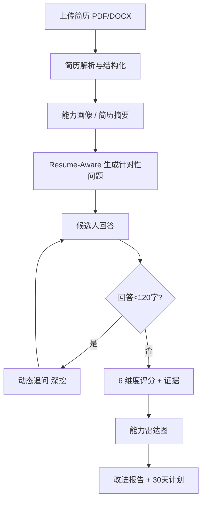

# PRD｜Resume-Aware Career Interview Agent（AI Career Copilot）

> 文档版本：v1.0（MVP 已实现 + 演进路线图）
> 角色：AI 产品经理 / AI 应用开发
> 最后更新：2026-08

> **阅读约定**：标注 【已实现】 的功能已在当前 MVP（`app.py` + `agents/`）中落地并可用；标注 【规划】 为产品演进方向，尚在设计中，避免与已实现能力混淆。

---

## 0. 文档概述

本文档定义「Resume-Aware Career Interview Agent」的产品需求，覆盖项目背景、用户画像、功能需求、Multi-Agent 架构、评分体系与路线图。产品定位为**基于 LLM 与 Multi-Agent 架构的 AI 求职陪练系统**，核心价值是让模拟面试真正"读懂"候选人简历，给出针对性问题与可追溯的多维评价。

---

## 1. 项目背景

传统求职准备存在结构性低效：

- **岗位匹配靠肉眼**：候选人难以判断自己与岗位的契合度，准备方向发散。
- **面试准备缺乏针对性**：通用面试题库与本人经历脱节，"背题"难以迁移到真实追问。
- **面试评价单一**：自评或单次反馈缺乏结构化维度，候选人不知道"差在哪、怎么补"。
- **缺乏持续成长反馈**：一次面试结束即终止，没有形成"评估→改进→再评估"的闭环。

大模型与 Agent 技术的成熟，使"低成本、个性化、可溯源"的 AI 陪练成为可能。

---

## 2. 用户画像

| 画像 | 描述 | 核心诉求 |
|------|------|----------|
| **应届秋招生** | 计算机/数据/产品相关专业的在校生 | 针对简历做 Mock，暴露能力短板，拿到可执行的提升计划 |
| **转岗求职者** | 期望从研发/运营转向 AI 产品等岗位 | 检验新岗位匹配度，补齐目标岗位能力叙事 |
| **职场进阶者** | 1-3 年经验、准备更高阶面试 | 用真实项目经历做深度追问，打磨表达与项目包装 |

**关键共性**：愿意为"针对性"与"反馈质量"付费注意力，厌恶泛泛而谈。

---

## 3. 用户痛点（Problem Statement）

1. 准备面试时，不知道**面试官会针对我的哪段经历提问**。
2. 回答完问题后，得不到**有证据支撑的多维评价**。
3. 收到分数却不知道**具体怎么改、按什么节奏改**。
4. 多次模拟之间**没有能力成长轨迹**。

---

## 4. 产品目标

帮助用户完成闭环：

> 找到适合的岗位 → 针对简历准备 → 进行真实模拟面试 → 获得多维评价 → 明确能力差距 → 拿到 30 天成长计划。

**核心指标假设**：面试完成率、追问触发率、报告生成率、30 天计划采纳率。

---

## 5. 用户流程

> 图中 **A–J 均为【已实现】**。规划中的「岗位推荐 / JD 解析 / 多面试官角色」将在第 12 节演进。

---

## 6. 功能需求（Functional Requirements）

| 编号 | 功能 | 状态 | 优先级 | 验收标准 |
|------|------|------|--------|----------|
| FR-01 | 简历上传（PDF / DOCX） | 【已实现】 | Must | 支持两种格式，解析失败给出明确提示 |
| FR-02 | 简历解析与结构化 | 【已实现】 | Must | 输出标准 JSON（教育/经历/项目/技能四分类） |
| FR-03 | 能力画像（摘要 + 技能分组） | 【已实现】 | Must | 技能按 技术/数据/产品/AI·ML 分组展示 |
| FR-04 | Resume-Aware 面试问题生成 | 【已实现】 | Must | 每题标注 `resume_ref` 与考察维度，强相关简历 |
| FR-05 | 动态追问（<120 字触发） | 【已实现】 | Should | 回答过简时自动深挖，引导具体细节 |
| FR-06 | 6 维度评分 + 雷达图 | 【已实现】 | Must | 每维度含 score 与 evidence，Plotly 雷达图渲染 |
| FR-07 | 改进报告 + 30 天计划 | 【已实现】 | Should | 输出优势/短板/建议/计划四段式 Markdown |
| FR-08 | 岗位推荐 | 【规划】 | Could | 基于画像推荐 ≥5 个匹配岗位与匹配度 |
| FR-09 | JD 解析与 JD-Aware 问题 | 【规划】 | Could | 输入 JD 后生成结合简历与 JD 的问题 |
| FR-10 | 多面试官角色评分 | 【规划】 | Could | HR/Business/Professional/Leader 独立评分 |
| FR-11 | 评分权重按岗位类型动态调整 | 【规划】 | Could | 不同岗位类型采用差异化维度权重 |

---

## 7. 非功能需求（Non-Functional Requirements）

- **安全（最高优先）**：API Key 仅存于本地 `.env`，绝不上传仓库；上传简历仅以文本送入 LLM，不做云端持久化。
- **性能**：单次 LLM 调用目标 < 15s，前端采用流式/加载态降低等待焦虑。
- **容错**：LLM 返回解析失败时，评分 Agent 兜底默认分并注明原因，保证流程不中断。
- **可扩展**：Agent 以独立模块组织（`agents/`），新增面试官角色或岗位类型可插拔。
- **兼容**：目标浏览器 Chrome / Edge（Web Speech 等增强能力在支持时启用）。

---

## 8. Agent 设计（Multi-Agent）

当前 MVP 采用 **4-Agent 协作**（由 `agents/` 模块承载）：

| Agent | 输入 | 输出 | 职责 |
|-------|------|------|------|
| **Resume Parser** | 简历原文 | 结构化 JSON + 摘要 | 抽取关键信息，生成能力画像 |
| **Interview** | 简历摘要 + 岗位 | 问题列表（含 resume_ref） | Resume-Aware 问题生成 |
| **Follow-up**（ Interview 内） | 原始问题 + 回答 | 追问文本 | 回答过简时定点深挖 |
| **Score** | 问答记录 | 6 维评分 + 证据 | 多维度评估，输出雷达图数据 |
| **Summary** | 评分 + 摘要 + 记录 | 改进报告 | 优势/短板/建议/30天计划 |

> **规划演进**：在现有 4-Agent 之上扩展 **Job Match Agent**（岗位推荐）、**JD Agent**（JD 解析）、**多面试官角色 Agent**（HR/Business/Professional/Leader 独立评分）与 **Chief Evaluation Agent**（汇总与冲突仲裁），形成更完整的 Multi-Agent 面试委员会。

---

## 9. 评分体系

采用 **6 维度、1–10 分、evidence-based** 评分：

| 维度 | 评估重点 |
|------|----------|
| 沟通能力 | 表达清晰度、逻辑连贯、观点传达 |
| 技术深度 | 技术栈理解、岗位硬技能 |
| 项目经验 | 项目细节、个人贡献与成果 |
| 问题解决 | 追问应变、思路清晰度 |
| 文化匹配 | 价值观与岗位匹配、协作意识 |
| 成长潜力 | 学习能力、自驱力、职业规划 |

**设计原则**：每一维分数必须附带 `evidence`（评分依据），将主观印象转为可追溯证据，是缓解"单一 AI 评分偏差"的核心机制。当前由单一 Score Agent 完成；规划演进为多面试官角色独立评分 + Chief 汇总 + 按岗位类型动态权重。

---

## 10. 数据指标

- **北极星指标**：完成一次「面试 → 报告」闭环的用户数。
- **过程指标**：上传转化率、追问触发率、报告生成率、30 天计划采纳率。
- **质量指标**：评分证据覆盖率（有 evidence 的维度占比）、用户满意度（报告有用性评分）。

---

## 11. 风险分析

| 风险 | 影响 | 缓解措施 |
|------|------|----------|
| 模型服务不可用 / 额度耗尽 | 功能中断 | 错误提示 + 评分兜底默认值 |
| 单一模型评分主观偏差 | 评价不公 | evidence 约束 + 规划多面试官交叉评分 |
| 简历含个人隐私 | 合规风险 | 仅文本送入 LLM，不上云存储；Key 本地化 |
| 多次 LLM 调用成本 | 体验/成本 | 阈值触发追问、控制 `max_tokens` |
| LLM 输出非标准 JSON | 解析失败 | 提取兜底 + 默认评分，保障流程不崩 |

---

## 12. 后续规划（Roadmap）

1. **RAG 岗位知识库**：注入行业/岗位知识，提升问题专业度。
2. **企业真实面试题库**：结合 JD 与公开题库生成更贴近实战的问题。
3. **更多岗位能力模型**：扩展能力维度与权重模板。
4. **用户长期成长数据**：跨多次模拟的能力轨迹与对比。
5. **面试语音分析**：结合 Web Speech API 做表达流畅度分析。
6. **多模态面试**：视频/屏幕共享场景下的综合评估。
7. **更完善的 Dashboard**：能力趋势、岗位匹配分布等数据看板。

---

*本文档随产品迭代更新，规划项以实际落地为准。*
